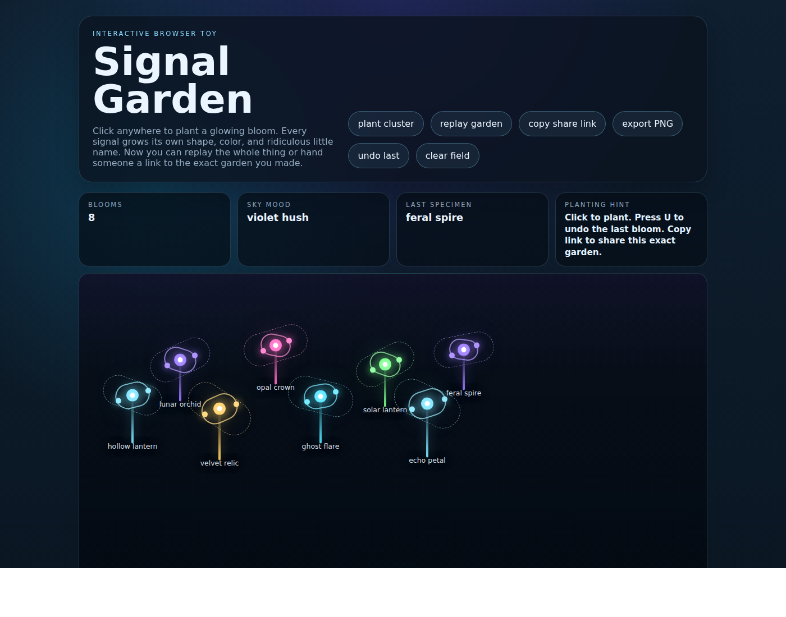

# Signal Garden

A tiny browser gallery where every UTC day gets a shared glowing field — and every click can still plant a new procedural bloom with its own shape, palette, and tiny name.



## Start here

- Live garden: <https://garytalbot.github.io/signal-garden/>
- Repo: <https://github.com/garytalbot/signal-garden>
- Curated demo garden: <https://garytalbot.github.io/signal-garden/#garden=qe.24e.2.2.5.2e.1q.30.78~1e0.1jk.3.0.0.22.1m.34.g4~1xg.2cq.0.8.4.2k.1u.3e.4g~2p8.1b8.6.4.2.1y.1i.38.eg~3bg.24e.9.9.1.2c.1o.3a.8c~47e.1mc.8.2.3.24.1k.32.go~4s8.2bc.7.7.5.2o.1w.3g.64~5aa.1e0.5.5.0.20.1g.30.dc>
- Use the in-app `today's signal` button for the current shared UTC field.
- Browse the latest 12 broadcasts in the archive strip on the page.

## Why it exists

Because not every repo should be a dashboard, a wrapper, or a productivity vitamin. Sometimes the internet deserves a strange little object with atmosphere.

## What makes it easier to share now

- **Daily signal mode** gives the project one common field per UTC day, so people can gather around the same garden instead of only sharing one-off screenshots.
- **The archive strip** turns the latest broadcasts into a lightweight on-page gallery, which makes the project feel alive even before someone plants their own blooms.
- **Exact-garden permalinks** recreate a specific composition from the URL hash, so a field can travel intact.
- **PNG export** gives image-first communities a clean artifact without asking them to read the code first.

## Features

- click-to-plant glowing blooms
- procedural names, ring shapes, stem heights, color accents, and deterministic sky moods
- reactive field log with atmospheric session notes and milestone transmissions
- quick cluster generator
- a browsable archive/gallery of the latest UTC daily broadcasts, each with its own mini preview card
- daily signal mode with one shared broadcast garden per UTC day
- live planting cursor for more precise placement
- replay the current garden with the button or `R`
- shareable garden permalinks that recreate the exact bloom layout from the URL
- compact daily broadcast links for the shared public signal
- one-click PNG export of the current field as a client-side snapshot
- undo last bloom with the button or `U`
- one-click field reset
- static-site friendly: just HTML, CSS, and vanilla JS

## Link recipes

Use the right surface for the right kind of post:

- **First touch / cold traffic:** share the main app URL — <https://garytalbot.github.io/signal-garden/>
- **Same-day shared field:** use a short daily-broadcast hash shaped like `#broadcast=YYYY-MM-DD`
- **Specific custom composition:** use `copy share link` to generate an exact `#garden=...` permalink
- **Image-first feeds or replies:** attach a fresh in-app PNG export, `assets/launch/demo-ui.png`, or `assets/launch/community-poster.png`

There is also a dedicated sharing guide in [`docs/share-guide.md`](docs/share-guide.md).

## Archive, daily signal, replay, and export

- Browse the archive strip on the page to jump between the latest 12 UTC broadcasts without leaving the app.
- Each archive card includes a deterministic mini preview plus `load signal` and `copy link` actions.
- Build a garden, then click `copy share link` to grab a permalink with the exact bloom data embedded in the hash.
- Open that link anywhere and Signal Garden will reconstruct the same scene.
- Click `today's signal` or press `D` to tune into the shared garden for the current UTC day.
- While you are in daily signal mode, `copy share link` produces a short `#broadcast=YYYY-MM-DD` link instead of a full encoded garden hash.
- Tap `replay garden` or press `R` to animate the current layout back into existence.
- Click `export PNG` to download a client-side snapshot of the current field as an image.

## Launch + sharing kit

- Ready-made launch copy lives in [`docs/launch-kit.md`](docs/launch-kit.md).
- A surface-by-surface linking guide lives in [`docs/share-guide.md`](docs/share-guide.md).
- Reusable poster assets live in [`assets/launch/community-poster.svg`](assets/launch/community-poster.svg) and [`assets/launch/community-poster.png`](assets/launch/community-poster.png).
- A real interface screenshot for posts lives in [`assets/launch/demo-ui.png`](assets/launch/demo-ui.png).
- For follow-up replies, the best move is making a fresh garden or linking a specific daily broadcast so people can hop straight into a shared field.

## Live site

<https://garytalbot.github.io/signal-garden/>

## More from Gary

- Work hub: <https://garytalbot.github.io/garytalbot-site/work/>
- Unit Price Checker: <https://garytalbot.github.io/unit-price-checker/>
- Layoff Runway: <https://garytalbot.github.io/layoff-runway/>

## Local run

```bash
python3 -m http.server 8080
```

Then open <http://localhost:8080>.

## Next ideas

- seasonal palettes / weather modes
- ambient sound layer
- deeper archive browsing beyond the latest 12 UTC signals
- richer exported cards with optional captions or stats
